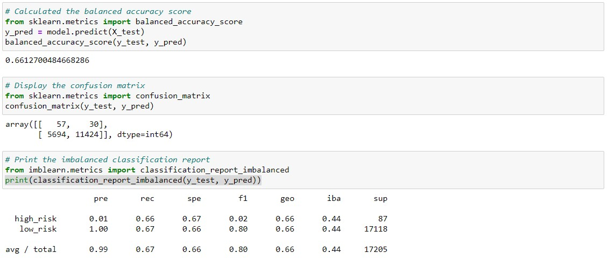
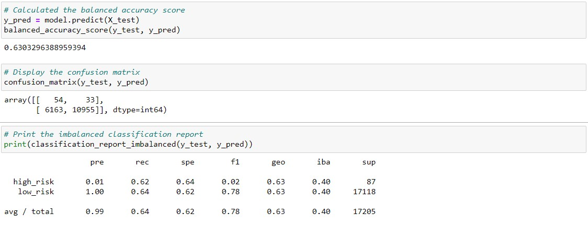
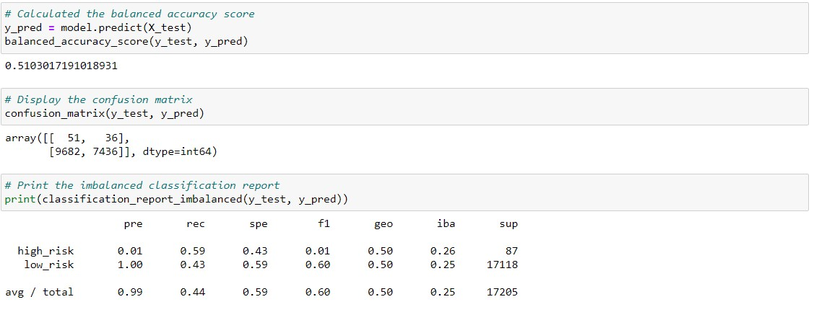
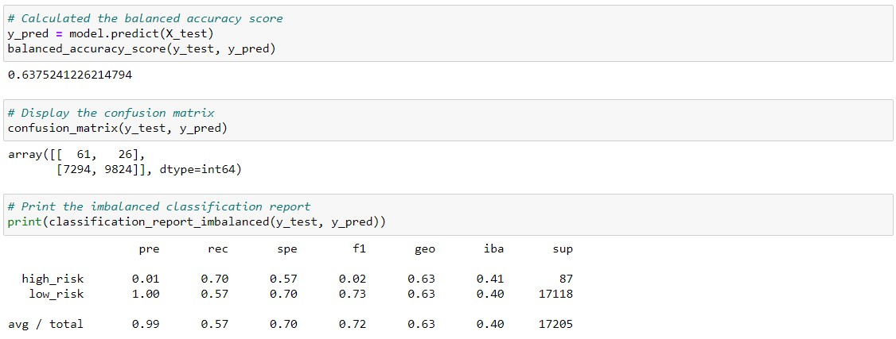
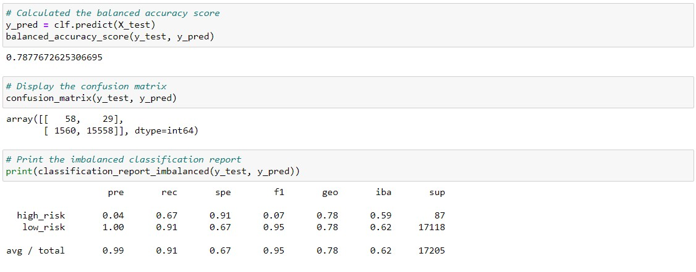
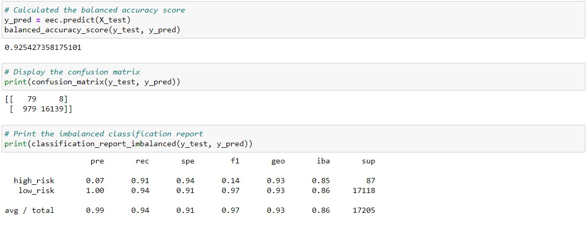

# Credit_Risk_Analysis

## Overview of the analysis  
  For this challenge we performed six different machine learning models, with the objective of finding out with model performs better and if we can recommend on particular machine learning model.  
  To evaluate the models, we will be using the credit card credit dataset from Lending Club. The machine learning models we will be using are:  
-	Oversampling
-	SMOTE Oversampling
-	Undersampling
-	Combination (Over and Under) Sampling
-	Balanced Random Forest Classifier
-	Easy Ensemble AdaBoost Classifier

## Results  

The results of all 6 machine learning models are summarized in the table below, the screenshots to support these results are under the table

#### Models Results Table
| Machine Learning Model| Balanced Accuracy Score |Precision | Recall|
| ------------- |-------------|-------------|-------------|
| Oversampling                     | 0.66 | 0.99| 0.67 |
| SMOTE Oversampling               | 0.63 | 0.99| 0.64 |
| Undersampling                    | 0.51 | 0.99| 0.44 |
| Combination Sampling             | 0.63 | 0.99| 0.57 |
| Balanced Random Forest Classifier| 0.78 | 0.99| 0.91|
| Easy Ensemble AdaBoost Classifier| 0.93 | 0.99| 0.94|

#### Image 1 – Oversampling Results  
  
#### Image 2 – SMOTE Oversampling Results  
  
#### Image 3 – Undersampling Results  
  
#### Image 4 – Combination Sampling Results  
  
#### Image 5 – Balanced Random Forest Classifier Results
  
#### Image 6 – Easy Ensemble AdaBoost Classifier Results  
  
